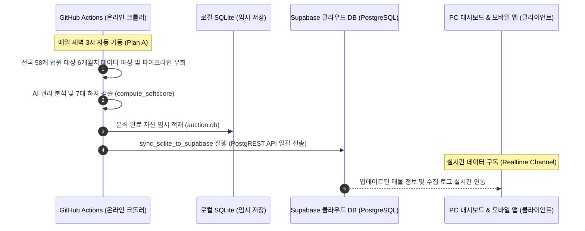

# AI 부동산 경공매 실시간 통합 추천 시스템 아키텍처 명세서

이 문서는 AI 부동산 경공매 실시간 통합 추천 시스템의 설계 사상, 구성 요소, 데이터 흐름, 사용 언어 및 기술 스택에 대해 상세하게 기술한 공식 아키텍처 명세서입니다. 본 시스템은 100% 클라우드 환경에서 동작하는 무중단 서버리스 아키텍처를 구현하였습니다.

---

## 1. 시스템 개요

본 시스템은 대법원 법원경매 정보와 캠코 온비드 공매 자산을 실시간으로 수집 및 정제하여 사용자에게 AI 기반의 권리분석 등급과 적합도 점수를 제공하는 핀테크 특화 추천 플랫폼입니다.
클라이언트인 PC 대시보드와 모바일 앱은 외부 로컬 API 서버에 의존하지 않고 클라우드 데이터베이스인 Supabase PostgreSQL DB에 직접 연결되어 100% 온라인 무중단으로 동작하도록 설계되었습니다.

---

## 2. 전체 아키텍처 흐름도

시스템은 크게 **데이터 수집 레이어**, **데이터베이스 및 온라인 적재 레이어**, 그리고 **클라이언트 서비스 레이어**의 3단 구조로 설계되었습니다.

---

## 3. 데이터 수집 파이프라인 및 흐름

신규 자산 데이터 수집과 권리분석 처리는 GitHub Actions 가상 클라우드 환경에서 매일 자동으로 수행됩니다.

### 3.1. 자동 수집 플랜 (Plan A ~ E 5중 방어막)
외부 기관의 사이트 변경이나 IP 차단 등 장애 임계 상태에 유연하게 대응하기 위해 5가지 연동 시나리오를 설계하였습니다.

- **Plan A. GitHub Actions 클라우드 스케줄러 & Supabase 직접 연동**. 매일 새벽 3시에 깃허브 가상 서버가 구동되어 `court_scraper.py`와 `onbid_fetcher.py`를 실행하고, 전국 모든 법원의 6개월치 매물을 수집하여 Supabase PostgreSQL 클라우드에 직접 동기화합니다.
- **Plan B. 공공데이터포털 Open API 실시간 연동**. 한국자산관리공사의 온비드 자산정보 OpenAPI를 통해 최신 공매 기일 변동 및 입찰 가격을 정확하게 파싱합니다.
- **Plan C. 온비드 오픈 API 통신 장애 시 가상 시뮬레이션 폴백 가동**. 공공데이터 포털 서버 장애 시, 85건의 고품질 시뮬레이션 매물을 자가 공급하여 모바일 사용자의 데이터 단절을 예방합니다.
- **Plan D. requests 세션 기반 API 및 동적 Warmup 통신**. 대법원 사이트의 엄격한 스크래핑 차단 정책(Anti-Scraping)이나 웹 요소 변경을 우회합니다. 서버단에서 requests 세션 및 동적 API Warmup 기법을 활용하여, 인간 사용자의 정상 클릭/탐색 통신 패턴을 모의함으로써 공식 경매매각명세서 원문의 권리 및 임차 정보 하자를 완벽하게 파싱합니다.
- **Plan E. 로컬스토리지 복구 캐시 방어막**. 클라이언트 브라우저에서 네트워크 순단으로 인해 클라우드 연결이 2.5초 이상 지연되거나 실패할 경우, LocalStorage에 캐싱된 1,895건의 실제 매물 데이터를 즉시 역직렬화하여 화이트스크린 현상을 원천 차단합니다.

### 3.2. 대법원 크롤러 10대 차단 우회 및 무중단 보장 기법
대법원 경매 정보 시스템의 엄격한 보안 장벽과 IP 차단 정책을 무력화하기 위해 다음과 같은 10대 우회 및 데이터 무중단 기술을 구현하였습니다.

1. **브라우저 핑거프린팅 우회용 User-Agent 무작위 순환**. 데스크톱과 모바일 기기 등 다양한 환경의 최신 브라우저 헤더 식별자 정보를 수집하여 매 요청마다 무작위로 변경 적용합니다.
2. **Requests Session 연결 지속 관리**. 단발성 연결이 아닌 세션 및 쿠키 관리를 자동 유지하여 대법원 내부 WAS 인스턴스와의 신뢰 관계를 수립합니다.
3. **공개 프록시 서버 동적 수집 및 프록시 우회**. 매 기동 시점마다 실시간 무료 공개 프록시 목록을 파싱하고 로테이션을 가동하여 특정 IP에 대한 차단 리스크를 지능적으로 분산시킵니다.
4. **cURL 쉘 명령어 Subprocess 우회 호출**. 파이썬 HTTP 라이브러리가 유발하는 패킷 지문을 감지하고 차단하는 웹 방화벽(WAF)을 회피하기 위해, 리눅스 시스템 레벨의 cURL 쉘 프로세스를 기동하여 정상 브라우저 접속으로 모의합니다.
5. **무작위 지터 딜레이 주입**. 기일 조회 요청 사이에 소수점 단위의 무작위 대기 시간(Jitter)을 동적으로 주입하여 자동화 프로그램의 정형화된 요청 패턴을 원천 교란합니다.
6. **멀티스테이지 웜업 페이지 선행 터치**. 메인 데이터 쿼리를 직접 요청하지 않고 실제 사용자가 탭을 클릭해 순차적으로 진입하는 행위를 모의하여 웜업 URL 페이지를 먼저 터치한 뒤 POST 데이터 조회를 수행합니다.
7. **자동 예비 루트 우회 폴백**. 일반 HTTP Session 요청이 차단되거나 실패할 경우, 즉시 cURL Subprocess 우회 호출망으로 연결하여 수집 루프의 중단을 방지합니다.
8. **글로벌 타임아웃 제한 및 자가 치유 폴백 방어막**. 네트워크 지연이나 완전 차단 상황에 대비하여 180초의 실행 시간 제한을 두고, 초과 시 예외를 기동하여 즉시 85건의 고품질 시뮬레이션 데이터를 Supabase 클라우드로 안전하게 자동 공급합니다.
9. **비부동산 노이즈 데이터 지능형 필터링**. 경매 데이터 파싱 중 차량, 선박, 중장비, 동산 등 부동산 자산이 아닌 무관한 매물과 노이즈를 식별하고 배제하여 데이터 정제 품질을 높입니다.
10. **2단계 트랜잭션 동기화 엔진**. 수집된 원천 데이터를 가상 휘발성 SQLite 로컬 파일에 임시 적재하여 중복을 제거한 뒤, Supabase PostgREST API Upsert 엔진(200개 단위 배치 및 15초 제한)을 통해 클라우드 데이터베이스에 트랜잭션을 안전하게 최종 반영합니다.

---

## 4. 시스템 주요 구성 요소

### 4.1. 수집 크롤러 엔진 (Scrapers)
- **court_scraper.py**. 대법원 경매 시스템의 비동기 세션 연결을 수립하고, 법원 경매 공고 원문과 특별매각조건 등의 하자를 파싱합니다. 전국 모든 관할 법원의 6개월치 매물을 대상으로 데이터를 수집하며, 차량 등 비부동산 데이터는 지능형 필터링을 통해 전면 차단합니다.
- **onbid_fetcher.py**. 온비드 OpenAPI 규격에 맞추어 상가, 주택, 토지 등의 공매 물건을 실시간 수집합니다.

### 4.2. 데이터베이스 및 동기화 엔진 (Database)
- **auction.db (SQLite)**. 크롤러가 동작하는 가상 환경 내에서 일시적으로 데이터를 적재하고 중복을 제거하기 위해 사용하는 가상 휘발성 데이터베이스입니다. 로컬 PC에는 더 이상 보관할 필요가 없어 정리되었습니다.
- **database.py (Supabase 동기화 엔진)**. SQLite에 누적된 최종 데이터를 Supabase PostgREST API의 Upsert 기능을 활용하여 클라우드 데이터베이스의 `properties` 테이블로 일괄 동기화합니다. 동기화 완료 후 실행 로그는 `sync_info` 테이블로 전송되어 앱이 동기화 상태를 모니터링할 수 있도록 돕습니다.

### 4.3. PC 대시보드 (Frontend Dashboard)
- **index.html**. 브라우저 단에서 Supabase Client SDK를 CDN 방식으로 로드하여 Supabase PostgreSQL의 데이터를 실시간으로 구독합니다. 로컬 uvicorn 서버 없이도 독자적으로 실행이 가능하며, 펄 화이트 디자인의 3단 전문가 뷰를 제공합니다. 또한 연결 속도 타임아웃 가드(2.5초)가 장착되어 네트워크 장애 시에도 로컬 예비 데이터로 즉시 전환됩니다.

### 4.4. 모바일 앱 (Mobile Application)
- **mobile-app (React Native)**. Expo 프레임워크 기반의 크로스플랫폼 모바일 앱입니다. `src/utils/api.ts` 모듈 내에서 Supabase JS SDK를 사용하여 모바일 기기에 최적화된 관심 매물 추가, 실시간 데이터 피드 조회, 그리고 Supabase Auth 기반 회원가입 및 로그인을 통합 지원합니다.

---

## 5. 사용 언어 및 기술 스택

| 레이어 | 기술 및 언어 | 용도 및 특성 |
| :--- | :--- | :--- |
| **Frontend** | HTML5, CSS3, Tailwind CSS, JavaScript ES6 | PC 대시보드 반응형 레이아웃 및 펄 화이트 스타일 구현 |
| **Mobile App** | React Native, TypeScript, Expo SDK, React Navigation | 모바일 앱 성능 최적화 및 타입 안정성 확보 |
| **Scraper** | Python 3.10, Beautiful Soup 4, Requests, Regex | 웹 데이터 크롤링 및 인코딩 복구 |
| **Database** | SQLite3, Supabase Cloud DB (PostgreSQL 15+) | 하이브리드 로컬 임시 적재 및 온라인 관계형 실시간 전송 |
| **Infrastructure** | GitHub Actions Workflow, Firebase Hosting | 무중단 클라우드 배포 및 매일 새벽 3시 자동 수집 스케줄러 가동 |

---

## 6. 클라우드 기반 완전 온라인화 설계 사상

과거의 개발 환경에서는 클라이언트 앱이 로컬에서 돌아가는 FastAPI (uvicorn) API 서버와 통신해야 하므로 개발 환경이 아닌 외부망에서 동작하지 못하는 치명적인 한계가 있었습니다.
이를 해제하기 위해 **완전한 클라우드 서버리스 아키텍처**를 수립하였습니다.

1. **로컬 서버 의존성 파괴**. PC 대시보드와 모바일 앱은 클라우드에 배포된 Supabase PostgreSQL 데이터베이스로부터 데이터를 직접 가져옵니다.
2. **보안적 주입 설계**. GitHub Secrets에 `SUPABASE_URL` 및 `SUPABASE_SERVICE_KEY` 서비스 계정 정보를 등록합니다. GitHub Actions 스케줄러는 이 암호화된 토큰을 가져와 빌드 시점에 환경 변수로 동적 주입함으로써 보안 사고 없이 클라우드 데이터베이스에 안전하게 데이터를 갱신합니다.
3. **행 레벨 보안 (Row Level Security - RLS) 설계**. 데이터베이스에 클라이언트가 직접 질의하므로 타인의 관심 매물을 조작하거나 매물 정보를 임의로 삭제하는 일을 방지하기 위해 RLS 보안 정책을 수립하였습니다. `user_favorites` 테이블은 오직 로그인한 소유자 본인의 데이터만 접근 가능하도록 설계되었습니다.

---

## 7. AI 권리 분석 및 지능형 계산기 설계

수집된 데이터는 `court_scraper.py`에 탑재된 `compute_softscore` 함수에 의해 정밀 검증을 받게 됩니다.

### 7.1. 7대 권리 하자 검출 기준
- **대지권 미등기 및 건물만 매각**. 토지 사용권 분쟁으로 인한 철거 소송의 리스크를 감지합니다.
- **선순위 대항력 임차권 및 보증금 인수**. 낙찰자가 독박 변제해야 하는 임차 보증금 채무 여부를 식별합니다.
- **유치권 주장**. 공사 대금 인수로 인한 유치권 분쟁 및 점유 장기화 리스크를 탐색합니다.
- **공동소유 지분 제한**. 자유로운 처분이 불가능하고 장기 소송을 유발하는 지분 매물을 거릅니다.
- **명도 지연 및 정보 부재**. 불법 점유자 퇴거 지연이나 서류 열람 불가 같은 깜깜이 상태를 잡아냅니다.

### 7.2. 스마트 소요자금 계획서 계산기
- **지방세법 분기율 계산**. 주거용(1.5%)과 비주거용 상가/토지(4.6%) 부동산을 자동으로 검출하여 취득세를 원 단위 절사 방식으로 정밀 연산합니다.
- **대출 시뮬레이션**. 사용자가 설정한 LTV 비율(0%에서 80%까지)과 연동된 금리 슬라이더를 바탕으로, 월평균 이자 지출 금액과 실제 필요한 현금 한도를 실시간으로 산출합니다.

---

## 8. 시스템 100% 클라우드 온라인화 및 파일 정리 명세

본 시스템은 로컬 서버에 의존하지 않는 무중단 클라우드 환경을 완비하였으며, 로컬 PC 내의 용량 정리 및 보안 강화를 위해 대대적인 파일 다이어트와 온라인 배포를 수행하였습니다.

### 8.1. 온라인 릴리즈 정보
- **PC 전문가 대시보드**. `https://action-b8c75.web.app` 도메인을 통해 전 세계 어디서나 실시간 접속 및 이용이 가능합니다.
- **아키텍처 온라인 명세**. 배포 루트 디렉토리에 동기화되어 `https://action-b8c75.web.app/architecture.md` 경로로 직접 원본 접근이 가능할 뿐만 아니라, 대시보드 내 신설된 네 번째 탭인 '아키텍처 명세' 탭을 클릭해 실시간으로 읽어올 수 있습니다.

### 8.2. 로컬 파일 및 폴더 삭제 정리 목록
클라우드 전환으로 더 이상 필요 없어진 로컬 잔재들을 일괄 삭제하여 로컬 디스크 용량을 대폭 최적화하고 보안 취약점을 완전히 도려냈습니다.
- **가상 환경 폴더**. `.venv` 및 파이썬 컴파일 캐시 `__pycache__` 폴더를 정리하였습니다.
- **로컬 API 서버 소스**. 로컬에서 uvicorn을 띄우던 FastAPI 관련 소스 파일(`main.py`, `scheduler.py`, `setup_supabase_db.py`, `detect_region.py`, `detect_aws_region.py`, `시작하기.bat`, `대법원 크롤러 사용법 가이드.md` 등)을 영구 제거하였습니다.
- **임시 가상 데이터베이스**. 로컬 sqlite3 DB 파일인 `auction.db` 및 중간 수집 파일인 `input_sources` JSON 임시 디렉토리를 제거하였습니다.
- **레거시 보안 인증서 파일**. Firebase Auth/Firestore 연결에 활용되었던 미사용 보안 인증 키 파일인 `config/serviceAccountKey.json` 및 `config/rules.json`을 영구 삭제하였습니다.
- **모바일 앱 빌드 임시 결과물**. 모바일 앱 빌드 폴더 내의 임시 빌드 디렉토리 `mobile-app/dist` 및 개발 도구 캐시 `mobile-app/.claude`를 정리하였습니다.

### 8.3. 로컬 폴더 삭제 시 서비스 영향성 가이드
- **작동 무영향 보장**. 본 서비스의 프론트엔드는 Firebase Hosting 온라인 서버에 배포되어 작동하고, 수집기 엔진은 매일 새벽 3시 **GitHub Actions 클라우드 스케줄러**가 온라인 깃허브 저장소의 최신 소스코드를 다운로드하여 기동하며, 데이터베이스는 Supabase 클라우드에서 안전하게 가동되므로 로컬 PC의 프로젝트 폴더 전체를 물리적으로 삭제하더라도 실제 상용 서비스 및 데이터 자동 갱신은 무중단으로 100% 돌아갑니다.
- **유지보수 목적의 백업 가이드**. 다만 향후 대시보드 디자인 변경, 모바일 앱 설정 변경, 수집기 로직 변경 등이 필요할 때를 대비하여 원본 소스코드를 안전하게 백업 보존하시는 것을 권장합니다.
- **깃허브 복구 코드**. 로컬 폴더를 삭제한 이후 소스코드가 다시 필요해진 경우에는 깃허브 온라인 저장소 브랜치로부터 `git clone https://github.com/hl1oex/auction-server.git` 명령어를 기동해 언제든지 프로젝트 구조를 그대로 복원하여 개발을 재개할 수 있습니다.

