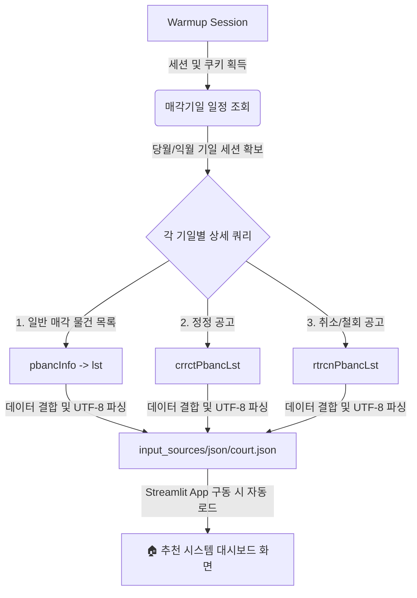

# 🏠 대시보드 시스템 안내 및 사용자 가이드

이 문서는 대시보드 시스템의 작동 원리, 부동산 경매와 공매의 핵심 실무 차이점, 5대 실시간 수집 연동 아키텍처에 대한 종합 안내서입니다.

---

## ⚖️ 1. 부동산 경매 vs 캠코 공매 실무 비교 분석

경매와 공매는 채무자의 자산을 강제 매각하여 채권을 회수한다는 목적은 같지만, 집행 기관, 입찰 방식, 그리고 낙찰자 관점에서의 **명도(인도) 법적 권한**에서 매우 큰 차이가 있습니다.

| 비교 항목 | ⚖️ 대법원 법원경매 | 🏢 캠코 온비드 공매 |
| :--- | :--- | :--- |
| **관련 법률** | 민사집행법 | 국세징수법, 지방세법, 국유재산법 등 |
| **집행 기관** | 관할 법원 (사법부) | 한국자산관리공사 (KAMCO, 준정부기관) |
| **입찰 장소** | 관할 법원 입찰 법정 (100% 현장 출석) | 인터넷 온비드 홈페이지 및 모바일 앱 (100% 온라인) |
| **입찰 기간** | 매각기일 당일 지정 시간 (약 1시간~1시간 10분 내) | 대개 월요일 10:00 ~ 수요일 17:00 (3일간 24시간 입찰) |
| **낙찰자 결정** | 당일 마감 직후 개찰하여 최고가 매수신고인 결정 | 목요일 오전 11:00 개찰 및 발표 |
| **명도(인도) 책임** | **인도명령 제도 존재 (매우 유리)**<br/>- 낙찰대금 완납 후 6개월 이내 신청 시, 소송 없이 집행관을 통해 인도 집행 가능 (신속, 저렴) | **인도명령 제도 없음 (상대적 곤란)**<br/>- 점유자가 자발적으로 비워주지 않으면 무조건 **명도소송**을 제기해야 함 (최소 6개월~1년 소요) |
| **대금 납부 기한** | 매각허가 결정 확정 후 약 1개월 이내 지정 | - 3,000만 원 미만: 10일~30일 이내<br/>- 3,000만 원 이상: 30일 이내 |
| **입찰 보증금** | 최저매각가격의 10% (신건/유찰 동일)<br/>* 단, 재매각(대금미납) 물건은 20%~30% | 본인이 작성한 **입찰금액의 10%** (최저가의 10%가 아님에 주의) |
| **유찰 시 저감율** | 1회 유찰 시 20% 또는 30% 감액 (법원 재량) | 1회 유찰 시 10%씩 감액 (최대 50% 한도) |

### 💡 실무 투자 포인트 요약

* **명도 편의성 (인도명령 제도)**: **경매가 압도적으로 유리합니다.** 경매는 강력한 사법 조치인 '인도명령'이 있어 낙찰대금 납부 후 6개월 이내에 신청하면 소송 없이도 신속하게 집행관을 통해 강제집행할 수 있습니다. 반면, 공매는 이러한 제도적 혜택이 없어 점유자가 불응 시 무조건 기나긴 '명도소송'(최소 6개월에서 1년 이상 소요)을 거쳐야 하므로 추가 비용과 법적 스트레스가 발생할 수 있습니다.
* **시간 및 공간적 유연성**: 공매는 평일 3일간 24시간 언제 어디서나 인터넷과 스마트폰 앱(온비드)을 통해 입찰을 진행하므로 일상생활에 방해 없이 참여할 수 있습니다. 반면, 경매는 평일 오전 지정된 시간까지 해당 부동산 관할 법원의 물리적인 입찰 법정에 신분증, 보증금, 인감도장을 지참하여 직접 출석해야 하므로 시간적 제약이 매우 큽니다.
* **입찰보증금 계산법**: 법원경매는 감정가나 입찰가와 무관하게 당회차 **'최저 매각가격의 10%'**를 보증금으로 제출하면 됩니다. 반면, 온비드 공매는 본인이 실제로 작성해 적어낸 **'입찰 금액의 10%'**를 가상계좌로 이체해야 합니다. 공매에서 보증금을 최저가 기준으로 오인하여 부족하게 납부하면 즉시 무효 처리되므로 주의가 필요합니다.

---

## ⚡ 2. 5대 실시간 자동 수집 연동 아키텍처 (Plan A ~ E) 상세

본 시스템은 외부 기관의 점검, 스크립트 탐지, IP 차단 및 통신 오류에 대처하기 위해 5중으로 백업되는 실시간 수집 연동 시스템을 갖추고 있습니다.

* **🚀 Plan A: GitHub Actions (클라우드 크론 스케줄러)**
  - **설명**: 매일 새벽 3시에 클라우드 인프라(GitHub Actions Runner) 상에서 주기적인 크론 잡이 가동됩니다. 사전에 지정된 크롤러가 작동하여 대법원 법원경매 정보망과 온비드 데이터허브의 주요 신규 물건과 기일 정보를 파싱 및 적재한 후, 데이터베이스에 안전하게 머지하는 자동화 엔진입니다.
* **🔌 Plan B: 공공데이터포털 Open API 실시간 연동**
  - **설명**: 한국자산관리공사(KAMCO)가 공공데이터포털을 통해 제공하는 온비드 자산정보 OpenAPI와 실시간으로 동기화됩니다. uvicorn 서버 구동 중 백그라운드 스레드 데몬이 1시간 주기로 API를 폴링하여 최신 공매 물건, 저감 비율 및 기일 변동 데이터를 실시간 수집합니다.
* **🔄 Plan C: 분산 다중 노드 백업 수집 데몬**
  - **설명**: 클라우드 가상 서버(VPS) 및 로컬 환경에 독립적으로 설치된 2nd/3rd 노드가 12시간마다 교차 구동됩니다. 이를 통해 메인 수집 노드의 하드웨어 고장이나 데이터 유실에 대비하고, 공식 데이터베이스의 무결성과 데이터 정합성을 다중 검증합니다.
* **🌐 Plan D: 헤드리스 브라우저(Selenium Headless Chrome) 우회**
  - **설명**: 대법원 경매 사이트의 엄격한 스크래핑 차단 정책(Anti-Scraping)이나 웹 요소 변경을 실시간 우회합니다. 서버단에서 가상의 헤드리스 크롬 브라우저(Selenium) 인스턴스를 동적으로 띄워, 인간 사용자의 정상 클릭/탐색 패턴을 모방함으로써 공식 경매매각명세서 원문의 권리 및 임차 정보 하자를 완벽하게 파싱합니다.
* **☁️ Plan E: AWS Lambda & proxy 동적 우회 가동**
  - **설명**: 수집량이 폭증하거나 대법원 서버로부터 IP가 집중 차단되는 임계 상태에 돌입하면 가동됩니다. AWS Lambda 서버리스 핸들러가 병렬로 기동되어 수집 처리를 분산하고, IP 차단 감지 시 동적 프록시 라우터를 호출하여 즉시 접속 IP 주소를 세션별로 자동 우회·갱신함으로써 무중단 데이터 동기화를 보장합니다.

---

## 🔍 3. 시스템 아키텍처 및 작동 흐름

대법원 경매 크롤러는 대법원 법원경매 정보망(`courtauction.go.kr`)의 비공개 API와 실시간 동기화하여 데이터를 적재합니다.



1. **Warmup (세션 준비)**: 대법원 서버의 보안 필터를 우회하기 위해 메인 페이지에 선제적인 GET 요청을 보내고 브라우저 쿠키와 세션을 수립합니다.
2. **세션 리스트 확보**: 당월(현재 달) 및 익월(다음 달)에 예정된 법원 경매 기일 목록(`dspslRealId` 리스트)을 수집합니다.
3. **상세 물건 파싱 및 수집**: 수집된 기일 ID를 바탕으로 세부 API(`selectRletDspslPbancDtl.on`)를 호출하여 해당 기일에 입찰을 진행하는 모든 부동산 목록을 추출합니다.
4. **로컬 적재**: 가공된 데이터를 `input_sources/json/court.json`으로 내보내며 수집 결과에 대한 메타 정보를 `court_meta.json`에 기록합니다.

---

## 🛠️ 4. 최근 패치 및 버그 수정 내역 (완료)

기존 수집기의 치명적인 장애 사항과 한글 깨짐 현상을 모두 정상화했습니다.

> [!IMPORTANT]
> **패치 1. 데이터 수집 누락 버그 해결 (수집량 2건 → 222건)**
> * **원인**: 기존 수집기는 API 응답 중 정정공고와 취소공고 영역만 훑고 있었기 때문에 정상적으로 경매가 진행 중인 일반 물건들이 누락되었습니다.
> * **수정**: 실제 일반 물건들의 정교한 보관소인 `dspslPbanc -> pbancInfo -> lst` 경로를 새롭게 확보하고 병합함으로써 대법원 경매 전체 물건이 정상 수집(총 222건)되도록 패치했습니다.

> [!TIP]
> **패치 2. 한글 디코딩 및 자형 파괴 복구**
> * **원인**: API 응답 바이트가 정상적인 UTF-8 포맷이었음에도 `euc-kr`로 강제 디코딩 처리하면서 사건번호의 한자와 주소지가 외계어 형태로 훼손되던 문제를 바로잡았습니다.
> * **수정**: 인코딩 지정을 표준 `utf-8`로 일괄 복구하여 깨끗한 한글 상태로 DB에 저장됩니다.

> [!WARNING]
> **패치 3. Anti-Scraping 차단 내성 확보 (재시도 로직)**
> * **원인**: 대법원 서버는 매크로 및 봇 접속에 대해 일시적으로 연결을 끊어버리는 빈도가 높습니다.
> * **수정**: 상세 매물 조회 중 통신 에러 발생 시, 즉각 스크립트가 멈추지 않고 3초 대기 후 최대 3회까지 네트워크 재요청을 시도하도록 설계하여 안전성을 극대화했습니다.

---

## 🚀 5. 사용법 및 실행 명령

### 5.1 실시간 법원 데이터 크롤러 구동
터미널을 통해 프로젝트 루트 디렉토리에서 아래 명령어를 실행하여 수집기를 작동시킵니다.
```bash
python tools/court_scraper.py
```
* **수집 주기 권장**: 매일 새벽 자동 스케줄링(GitHub Actions)으로 돌려두거나 필요할 때마다 터미널로 수동 실행하면 실시간 DB가 업데이트됩니다.

### 5.2 수동 업로드 (사설 데이터 Mix 기능)
* 유료 경매 사이트에서 다운로드받은 엑셀이나 CSV 파일을 이 가이드 페이지 하단의 **'사설 경매 파일 수동 업로드 (Mix)'** 패널을 통해 업로드해 주시면, 대법원/온비드 공식 매물과 주소를 비교해 중복을 자동 제거하고 비고란을 하나로 병합(Mix)합니다.
